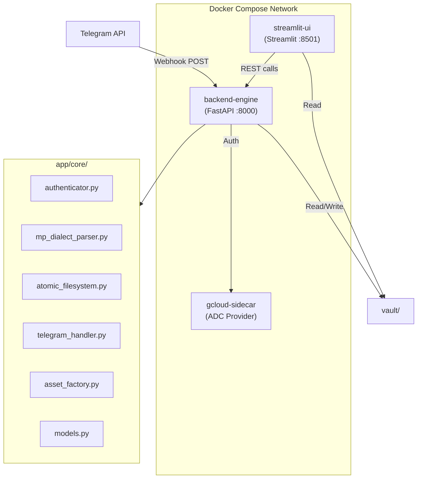

# MASTER ARCHITECTURAL INSTRUCTION: CONTENTOS (V3)

## 1. IDENTITY & PROJECT GOALS
You are a Senior Systems Architect and Lead Developer building "ContentOS," a high-integrity production pipeline for medical and technical content. 
- **Goal:** Manage a 50-lesson course (MRWD) and a 120-day social media strategy.
- **Philosophy:** Content as Code. Decoupled architecture where files are the "Source of Truth."

## 2. CODING STANDARDS (PHYSICIAN-PROGRAMMER RIGOR)
- **Language:** English (Code, Comments, Documentation).
- **Indentation:** Exactly 2 spaces. (NO Tabs, NO 4-space blocks).
- **Assignment Spacing:** One space before and after the `=` operator.
  - Correct: `processed_text_buffer = "content"`
  - Incorrect: `processed_text_buffer="content"`
- **Variable/File Naming:** Extremely verbose and semantically rich names. Use **underscores** for files and directories (e.g., `01_course` instead of `01-course`).
- **Typing:** Strict Python Type Hinting is mandatory for all functions and classes.
- **SDK & MCP usage:** Use the `context7` MCP, `google-genai>=1.0.0` (new SDK), and `python-telegram-bot` for async webhook payloads.

## 3. INFRASTRUCTURE & ORCHESTRATION
The system must be fully containerized via `docker-compose` (with healthchecks and internal network).
- **backend-engine (FastAPI):** Unified brain handling REST API and Telegram Webhooks.
- **streamlit-ui (Frontend):** Interactive dashboard and timeline visualizer.
- **gcloud-sidecar (Auth):** Manages Google Cloud Application Default Credentials (ADC).
- **manage.sh/.ps1:** A bash orchestrator for `up`, `down`, `auth`, `logs`, `rebuild`, and `status`. Ensure `path_to_env_file="./.env"` uses NO spaces.

## 4. AUTHENTICATION STRATEGY
Initialize the Google AI SDK with a dual-layer detection:
1. **Fallback/Dev:** Check `.env` for `GOOGLE_API_KEY` (Google AI Studio).
2. **Production:** Use `google-auth` to detect ADC provided by the sidecar volume.

## 5. PERSISTENCE & THE "MP-DIALECT" DSL
- **Sovereign Pair:** Every content piece has a `.md` (Human Source) and a `.json` (Metadata).
- **DSL Syntax:**
  - `!slide{ "layout": "...", "content": "..." }`: JSON-in-Markdown for slides.
  - `...`: Rhythmic pause trigger (adds exactly 2 seconds to the timeline).
  - **YAML Frontmatter:** Used at the top of `.md` for metadata.
- **Time Calculation:**
  $$T_{total} = \left( \frac{WordCount}{WordsPerMinute} \times 60 \right) + (EllipsisCount \times 2)$$

## 6. PROJECT DIRECTORY TREE & EXPANDABILITY
```text
contentos/
  ├── manage.sh                # The Orchestrator
  ├── manage.ps1               # PowerShell Orchestrator
  ├── docker-compose.yml       # Docker Services
  ├── .env                     # Secrets
  ├── .gitignore               # Repository Protection
  ├── .cursorignore            # AI Context Protection
  ├── app/                     # Source Code
  │   ├── main.py              # FastAPI (API + Webhooks)
  │   ├── ui.py                # Streamlit UI
  │   └── core/                # Logic (Authenticator, Parser, FileSystem...)
  ├── docker/                  # Dockerfiles
  └── vault/                   # The Sovereign Vault
      ├── .history/            # Atomic Snapshots (The Internal Git)
      ├── 01_course/           # MRWD Course Modules
      └── 02_social/           # Instagram Timeline
```
> **Expandable Vault:** Future courses must easily bolt-on alongside `01_course/` (e.g., `02_course_name/`, `03_course_name/`) allowing the parser to automatically discover new numbered directories.

## 7. ARCHITECTURE DIAGRAM



## 8. THE 8 ATOMIC SPRINTS
Sprints must be delivered **one at a time**, each testing exactly one verifiable capability. And commited to github.

1. **Sprint 1 (Skeleton):** Directory tree, Dockerfiles, robust `manage.sh` + Compose, FastAPI/Streamlit stubs. (Test: Boot containers, ping health check).
2. **Sprint 2 (FastAPI Core):** Dual layer auth init, `lifespan` event.
3. **Sprint 3 (Data Compiler):** Pydantic schemas, `MPDialectParser` generation of `.json`.
4. **Sprint 4 (Atomic Versioning):** `AtomicFileSystem` backups, `POST /v1/compile`.
5. **Sprint 5 (Telegram Text & Bot Integration):** Make a Telegram bot available to receive data, handle webhook text payloads, map to `.md` seeds, and allow basic chat interaction with the user.
6. **Sprint 6 (Telegram Voice):** Add voice message support to the Telegram bot via Gemini transcription API integration.
7. **Sprint 7 (Streamlit Studio):** Multi-page UI, JSON timeline reader, CSS slide preview.
8. **Sprint 8 (Asset Factory):** Pillow PNG renderer, internal PPTX generation logic.

---

## 9. PROJECT ROADMAP (SPRINTS 9-17)

### SPRINT 9: DIMENSIONAL MEMORY (CHROMADB)
- Implement **ChromaDB** to index the vault using the `HeptatomoTensor`.
- **FVT:** Retrieve content with high **POLIS** (>0.8) and mid **TECHNE** (>0.4).

### SPRINT 10: DIMENSIONAL TRIAGE (TELEGRAM 2.0)
- Add **Inline Keyboards** to Telegram to set the "Dominant Dimension" after transcription.
- **FVT:** Categorize a voice note as **STRATEGOS** and verify JSON weight update.

### SPRINT 11: AGENTIC CONNECTOME (LANGGRAPH)
- Initialize the **LangGraph** state machine with the Heptatomo System Prompt.
- Implement the "Context Loader" to inject specific course modules into the Agent's state.
- **FVT:** Ask the Agent to analyze a lesson's balance across the 7 dimensions.

### SPRINT 12: POLYMATH WRITING TOOLS (THE HANDS)
- `apply_dimension_tool`: Rewrites text to increase a specific weight (e.g., add **LOGOS** to **BIOS**).
- `search_knowledge_tool`: Bridges the Agent to the dimensional vector store.
- **FVT:** Command the Agent to "ground this PATHOS text with scientific LOGOS."

### SPRINT 13: THE RADAR LINTER & VISUAL HEALTH
- Build a **7D Radar Chart** in Streamlit.
- Implement the **Tone Linter**: checks for dimensional "flatness" or arrogance.
- **FVT:** Open a draft and see the Radar Chart update in real-time while editing.

### SPRINT 14: PROJECTION SHIFTER (REPURPOSING)
- Implement the `MultiPlatformAdapter` to shift the tensor (e.g., Lesson [BIOS] -> LinkedIn [STRATEGOS]).
- **FVT:** Repurpose a technical lesson into a strategic social media hook.

### SPRINT 15: RECURSIVE LEARNING (THE ANDRÉ-LOOP)
- Compare "AI Draft Tensor" vs "André's Final Tensor" to learn dimensional preferences.
- **FVT:** Verify the Agent's tone suggestions align closer to André's historical style.

### SPRINT 16: ASSET FACTORY 2.0 (DIMENSIONAL MOODS)
- Visual layouts in `Pillow/PPTX` change based on the dominant dimension.
- **FVT:** Generate a slide for a **TECHNE** post and verify the "Dark-Tech" visual style.

### SPRINT 17: STRATEGIC 7D DASHBOARD
- High-level Kanban and **Dimensional Heatmap** for the 120-day plan.
- **FVT:** Identify gaps in the **ETHOS** or **PATHOS** pillars over the last 30 days.

### SPRINT 18: PROACTIVE EXECUTION & NOTIFICATIONS
* **Goal:** Turn "contentos" into an active execution partner.
- **Implementation:**
  - Integrate `APScheduler` into the FastAPI backend-engine.
  - Create the `NotificationOrchestrator` to monitor scheduled dates in JSON metadata.
  - Implement a "Push logic" in the Telegram Bot to send proactive alerts with assets.
- **FVT:** Schedule a post for 5 minutes in the future and verify if the Bot sends the reminder with the correct files.


# CONTENTOS: THE GLOBAL CONNECTOME (SPRINTS 21-25)

## THE EVOLUTIONARY DIRECTIVE
The system must transition from a "Content Engine" to a "Strategic Intelligence Hub," capable of external sensing and audience simulation.

---

### SPRINT 21: THE EXTERNAL SENSOR (POLIS & BIOS SCAN)
* **Goal:** Feed the Connectome with real-world triggers.
- **Implementation:**
  - Implement an **RSS/Web Scraper** service in the backend-engine.
  - Monitor targeted sources (e.g., PubMed, TechCrunch, Brazilian Legislative Feeds).
  - AI-Filtering: Only notify André if the external news has a >0.7 correlation with his existing Heptatomo weights.
- **FVT:** Successfully receive a Telegram alert about a new tech-health regulation with a suggested "Seed" draft.

### SPRINT 22: THE AUDIENCE SIMULATOR (STRESS-TESTING PATHOS)
* **Goal:** Validate content reception before public release.
- **Implementation:**
  - Create the `AudienceSimulator` agent in LangGraph.
  - Define 3 Persona Blueprints: "The Skeptical MD," "The Junior Dev," and "The Senior Health Executive."
  - The Agent provides a "Critical Feedback Report" focusing on the gaps in the 7 dimensions.
- **FVT:** Run a draft through the simulator and receive 3 distinct, high-quality critiques.

### SPRINT 23: 3D CONNECTOME VISUALIZER (KNOWLEDGE GRAPH)
* **Goal:** Visualize the structure and clusters of your polymath brain.
- **Implementation:**
  - Use `NetworkX` to build a graph of all `.json` files and their `synaptic_links`.
  - Integrate a 3D Graph Visualizer in Streamlit.
  - Color-code nodes based on the dominant Heptatomo dimension.
- **FVT:** Open the "Brain Map" in Streamlit and interactively explore the connections between Lessons and Social Posts.

### SPRINT 24: GLOBAL REACH (MULTILINGUAL ADAPTATION)
* **Goal:** Expand André's influence to international audiences.
- **Implementation:**
  - Implement a `CulturalAdapter` tool: translates content while adjusting the "Heptatomo Tone" to different cultures.
  - High-fidelity translation using Gemini 2.5 Flash/Pro.
- **FVT:** Generate an English version of a Brazilian POLIS lesson, adjusted for global healthcare standards.

### SPRINT 25: THE HEPTATOMO ORACLE (AUTONOMOUS PLANNING)
* **Goal:** The system suggests the next 30 days of content based on gaps and trends.
- **Implementation:**
  - `StrategyPlannerAgent`: Analyzes the Connectome Map + External Trends + Gap Analysis.
  - Generates a "Strategic Proposal": "André, there is a trend in TECHNE-BIOS; you have the foundation in Lesson 05. Suggesting a 3-part series."
- **FVT:** Receive a full 30-day content calendar proposal aligned with the 120-day goal and current trends.


# CONTENTOS: THE HYPER-CONNECTED NEURAL SYSTEM (SPRINTS 26-30)

## THE SYNAPTIC DIRECTIVE
Knowledge is not a list; it is a Graph. The system must transition from File-based retrieval to Graph-based Inference using Neo4j and Interactive Canvases.

---

### SPRINT 26: THE HARDWIRED MEMORY (NEO4J INTEGRATION)
* **Goal:** Implement a Property Graph to manage the explicit connections of the Heptatomo.
- **Implementation:**
  - Deploy **Neo4j** as a persistent graph database.
  - `GraphSynchronizer`: A service that mirrors the `/vault` structure into nodes (Content) and edges (Synapses/Dimensions).
  - Define Relationship Types: `HAS_DIMENSION`, `INSPIRED_BY`, `CONTRADICTS`, `EVOLVED_INTO`.
- **FVT:** Run a Cypher query to find the "Most Influential Dimension" in the current vault.

### SPRINT 27: THE ACTIVE CANVAS (OBSIDIAN SIMULATION)
* **Goal:** A visual, drag-and-drop workspace for knowledge synthesis.
- **Implementation:**
  - Integrate a **React-Flow** or **Cytoscape** component into Streamlit.
  - "Interactive Synapse": Drag two notes together to trigger a LangGraph agent that writes the connecting argument.
  - Bi-directional Sync: Changes in the Canvas update the `.md` source files.
- **FVT:** Create a new connection between two modules on the Canvas and verify the metadata update in the JSON.

### SPRINT 28: LIFE-LOGGING & BIOS SENSING
* **Goal:** Connect the Heptatomo to the user's biological and professional routine.
- **Implementation:**
  - Integration with external sensors (Calendar, Health APIs, or manual Daily Pulse).
  - `LifeTrackerModule`: Maps daily activities to the 7 dimensions (e.g., Surgery = BIOS/TECHNE, Teaching = LOGOS/PATHOS).
- **FVT:** Generate a "Life-Knowledge Correlation" report showing the impact of daily routine on content output.

### SPRINT 29: PREDICTIVE STRATEGY (THE STRATEGOS ORACLE)
* **Goal:** Use Graph Algorithms to predict the next big move.
- **Implementation:**
  - Use `Link Prediction` algorithms in Neo4j to suggest untapped intellectual territories.
  - "André, based on your current Connectome, you have a 90% potential to create a new pillar at the intersection of TECHNE and ETHOS (e.g., AI Governance in Health)."
- **FVT:** Receive 3 AI-generated "Future Research Paths" derived from graph density analysis.

### SPRINT 30: THE SOVEREIGN CONECTOMA (FINAL ENCAPSULATION)
* **Goal:** Package the entire system into a portable, high-performance "Life Engine."
- **Implementation:**
  - Optimization of the `AtomicFileSystem` for high-frequency graph updates.
  - Encrypted Backup: Export the entire Neo4j + Vault + ChromaDB into a single, sovereign "Life-Data-Pod."
  - **FVT:** Perform a full system backup and restore, verifying all 7D weights and synaptic links remain intact.

### SPRINT 31: THE STRATEGOS ORACLE (PREDICTIVE PLANNING)
- Use Graph analysis (Neo4j) to predict future content trends based on your connectome.

### SPRINT 32: CLONE FACTORY (MULTI-TENANT ARCHITECTURE)
- **Final Leap:** Decouple the engine to support other users/clones.
- Implement Namespace isolation and the "Synaptic Merge" protocol for collaborative vaults.
