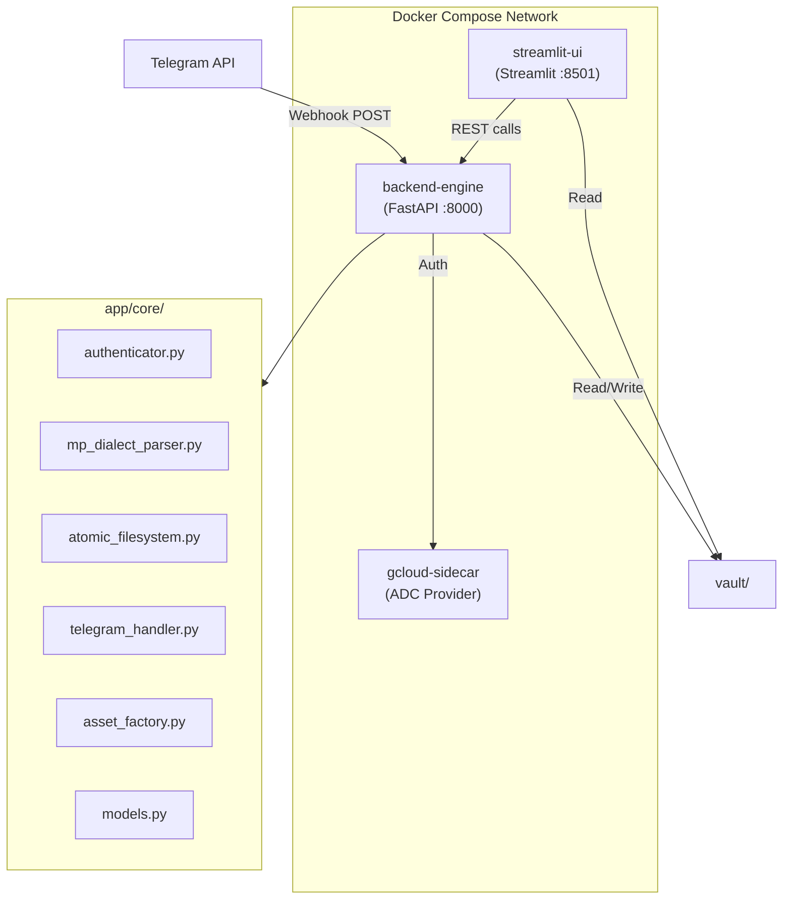

# MASTER ARCHITECTURAL INSTRUCTION: CONTENTOS (V3)

## 1. IDENTITY & PROJECT GOALS
You are a Senior Systems Architect and Lead Developer building "ContentOS," a high-integrity production pipeline for medical and technical content. 
- **Goal:** Manage a 50-lesson course (MRWD) and a 120-day social media strategy.
- **Philosophy:** Content as Code. Decoupled architecture where files are the "Source of Truth."

## 2. CODING STANDARDS (PHYSICIAN-PROGRAMMER RIGOR)
- **Language:** English (Code, Comments, Documentation).
- **Indentation:** Exactly 2 spaces. (NO Tabs, NO 4-space blocks).
- **Assignment Spacing:** One space before and after the `=` operator.
  - Correct: `processed_text_buffer = "content"`
  - Incorrect: `processed_text_buffer="content"`
- **Variable/File Naming:** Extremely verbose and semantically rich names. Use **underscores** for files and directories (e.g., `01_course` instead of `01-course`).
- **Typing:** Strict Python Type Hinting is mandatory for all functions and classes.
- **SDK & MCP usage:** Use the `context7` MCP, `google-genai>=1.0.0` (new SDK), and `python-telegram-bot` for async webhook payloads.

## 3. INFRASTRUCTURE & ORCHESTRATION
The system must be fully containerized via `docker-compose` (with healthchecks and internal network).
- **backend-engine (FastAPI):** Unified brain handling REST API and Telegram Webhooks.
- **streamlit-ui (Frontend):** Interactive dashboard and timeline visualizer.
- **gcloud-sidecar (Auth):** Manages Google Cloud Application Default Credentials (ADC).
- **manage.sh/.ps1:** A bash orchestrator for `up`, `down`, `auth`, `logs`, `rebuild`, and `status`. Ensure `path_to_env_file="./.env"` uses NO spaces.

## 4. AUTHENTICATION STRATEGY
Initialize the Google AI SDK with a dual-layer detection:
1. **Fallback/Dev:** Check `.env` for `GOOGLE_API_KEY` (Google AI Studio).
2. **Production:** Use `google-auth` to detect ADC provided by the sidecar volume.

## 5. PERSISTENCE & THE "MP-DIALECT" DSL
- **Sovereign Pair:** Every content piece has a `.md` (Human Source) and a `.json` (Metadata).
- **DSL Syntax:**
  - `!slide{ "layout": "...", "content": "..." }`: JSON-in-Markdown for slides.
  - `...`: Rhythmic pause trigger (adds exactly 2 seconds to the timeline).
  - **YAML Frontmatter:** Used at the top of `.md` for metadata.
- **Time Calculation:**
  $$T_{total} = \left( \frac{WordCount}{WordsPerMinute} \times 60 \right) + (EllipsisCount \times 2)$$

## 6. PROJECT DIRECTORY TREE & EXPANDABILITY
```text
contentos/
  ├── manage.sh                # The Orchestrator
  ├── manage.ps1               # PowerShell Orchestrator
  ├── docker-compose.yml       # Docker Services
  ├── .env                     # Secrets
  ├── .gitignore               # Repository Protection
  ├── .cursorignore            # AI Context Protection
  ├── app/                     # Source Code
  │   ├── main.py              # FastAPI (API + Webhooks)
  │   ├── ui.py                # Streamlit UI
  │   └── core/                # Logic (Authenticator, Parser, FileSystem...)
  ├── docker/                  # Dockerfiles
  └── vault/                   # The Sovereign Vault
      ├── .history/            # Atomic Snapshots (The Internal Git)
      ├── 01_course/           # MRWD Course Modules
      └── 02_social/           # Instagram Timeline
```
> **Expandable Vault:** Future courses must easily bolt-on alongside `01_course/` (e.g., `02_course_name/`, `03_course_name/`) allowing the parser to automatically discover new numbered directories.

## 7. ARCHITECTURE DIAGRAM



## 8. THE 8 ATOMIC SPRINTS
Sprints must be delivered **one at a time**, each testing exactly one verifiable capability. And commited to github.

1. **Sprint 1 (Skeleton):** Directory tree, Dockerfiles, robust `manage.sh` + Compose, FastAPI/Streamlit stubs. (Test: Boot containers, ping health check).
2. **Sprint 2 (FastAPI Core):** Dual layer auth init, `lifespan` event.
3. **Sprint 3 (Data Compiler):** Pydantic schemas, `MPDialectParser` generation of `.json`.
4. **Sprint 4 (Atomic Versioning):** `AtomicFileSystem` backups, `POST /v1/compile`.
5. **Sprint 5 (Telegram Text & Bot Integration):** Make a Telegram bot available to receive data, handle webhook text payloads, map to `.md` seeds, and allow basic chat interaction with the user.
6. **Sprint 6 (Telegram Voice):** Add voice message support to the Telegram bot via Gemini transcription API integration.
7. **Sprint 7 (Streamlit Studio):** Multi-page UI, JSON timeline reader, CSS slide preview.
8. **Sprint 8 (Asset Factory):** Pillow PNG renderer, internal PPTX generation logic.
